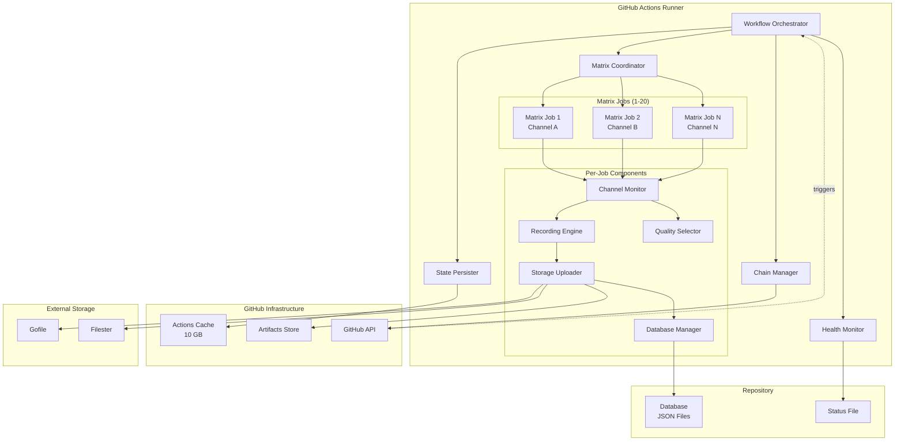

# Design Document: GitHub Actions Continuous Runner

## Overview

This design adapts the GoondVR livestream recording service to run continuously on GitHub Actions despite the platform's 6-hour maximum job execution time. The solution implements an auto-restart chain pattern where workflow runs trigger their own replacements before timeout, combined with state persistence using GitHub Actions cache, dual external storage uploads (Gofile and Filester), and matrix-based parallel channel recording.

### Key Design Principles

1. **Autonomous Operation**: The system self-manages its lifecycle without manual intervention
2. **State Continuity**: Configuration and partial recordings persist across workflow transitions
3. **Parallel Execution**: Matrix jobs enable independent recording of up to 20 channels simultaneously
4. **Storage Redundancy**: Dual uploads to Gofile and Filester ensure recording preservation
5. **Graceful Degradation**: The system recovers from transient failures and continues operation

### Constraints and Limitations

- **6-hour hard limit**: GitHub Actions terminates jobs after 6 hours
- **14 GB disk space**: Runner storage is limited
- **10 GB cache limit**: Per-repository cache storage constraint
- **Recording gaps**: 30-60 second gaps occur during workflow transitions
- **API rate limits**: GitHub API calls for workflow dispatch are rate-limited
- **Concurrent job limits**: Free tier allows 20 concurrent jobs

## Architecture

### High-Level Architecture



### Component Responsibilities

#### Workflow Orchestrator
- Initializes the workflow run with session identifier
- Coordinates timing for graceful shutdown at 5.4 hours
- Manages matrix job creation and channel assignment
- Validates configuration inputs before operation

#### Chain Manager
- Monitors workflow runtime and triggers replacement at 5.5 hours
- Uses GitHub API `workflow_dispatch` to start next run
- Passes session state via workflow inputs
- Implements retry logic with exponential backoff
- Prevents duplicate chains using unique session identifiers

#### State Persister
- Saves/restores configuration files to/from GitHub Actions cache
- Saves/restores partial recordings to/from cache
- Uses session-specific cache keys to prevent conflicts
- Verifies cache integrity with checksums
- Maintains state manifest with file metadata

#### Matrix Coordinator
- Distributes channel assignments across matrix jobs
- Manages shared configuration cache
- Maintains job registry for active matrix jobs
- Coordinates database updates to prevent conflicts
- Handles matrix job failure recovery

#### Channel Monitor (per Matrix Job)
- Polls assigned channel for online status
- Detects stream availability
- Manages recording lifecycle
- Implements existing GoondVR channel monitoring logic

#### Recording Engine (per Matrix Job)
- Captures livestream using existing GoondVR recording logic
- Handles stream format detection (HLS/DASH)
- Manages file splitting based on size/duration limits
- Writes recordings to local disk

#### Storage Uploader (per Matrix Job)
- Uploads completed recordings to Gofile and Filester in parallel
- Retrieves Gofile server address dynamically
- Implements retry logic with exponential backoff
- Falls back to GitHub Artifacts on failure
- Deletes local files after successful upload
- Handles file splitting for Filester 10 GB limit

#### Database Manager (per Matrix Job)
- Organizes video metadata in repository structure
- Creates/updates JSON files at `database/{site}/{channel}/{YYYY-MM-DD}.json`
- Uses git pull-commit-push for atomic updates
- Handles concurrent updates from multiple matrix jobs
- Validates JSON structure before committing

#### Quality Selector (per Matrix Job)
- Attempts 4K 60fps as first priority
- Falls back through quality tiers: 1080p60 → 720p60 → highest available
- Overrides existing configuration with maximum quality settings
- Detects available quality options from stream
- Logs actual recorded quality

#### Health Monitor
- Tracks system health across all matrix jobs
- Sends notifications for workflow lifecycle events
- Monitors disk space every 5 minutes
- Triggers emergency actions on disk pressure
- Updates status file in repository
- Supports Discord and ntfy notification targets

## Components and Interfaces

### Chain Manager Interface

```go
type ChainManager struct {
    sessionID       string
    startTime       time.Time
    nextRunTriggered bool
    githubToken     string
    repository      string
    workflowFile    string
}

// TriggerNextRun initiates the next workflow run via GitHub API
func (cm *ChainManager) TriggerNextRun(ctx context.Context, state SessionState) error

// MonitorRuntime checks elapsed time and triggers chain at 5.5 hours
func (cm *ChainManager) MonitorRuntime(ctx context.Context) error

// GenerateSessionID creates a unique identifier for this workflow run
func (cm *ChainManager) GenerateSessionID() string
```

**GitHub API Integration:**
- Endpoint: `POST /repos/{owner}/{repo}/actions/workflows/{workflow_id}/dispatches`
- Authentication: Bearer token from `GITHUB_TOKEN` secret
- Payload: `{"ref": "main", "inputs": {"session_state": "<json>"}}`

### State Persister Interface

```go
type StatePersister struct {
    cacheClient *cache.Client
    sessionID   string
}

type StateManifest struct {
    Files []FileEntry `json:"files"`
}

type FileEntry struct {
    Path      string    `json:"path"`
    Checksum  string    `json:"checksum"`
    Size      int64     `json:"size"`
    Timestamp time.Time `json:"timestamp"`
}

// SaveState persists configuration and partial recordings to cache
func (sp *StatePersister) SaveState(ctx context.Context, config *Config, recordings []Recording) error

// RestoreState retrieves configuration and partial recordings from cache
func (sp *StatePersister) RestoreState(ctx context.Context) (*Config, []Recording, error)

// VerifyIntegrity checks cache data against checksums
func (sp *StatePersister) VerifyIntegrity(manifest StateManifest) error
```

**Cache Key Strategy:**
- Configuration: `config-{session_id}`
- Shared config: `shared-config-latest`
- Per-job state: `state-{session_id}-{matrix_job_id}`
- Manifest: `manifest-{session_id}`

### Storage Uploader Interface

```go
type StorageUploader struct {
    gofileAPIKey    string
    filesterAPIKey  string
    httpClient      *http.Client
}

type UploadResult struct {
    GofileURL     string
    FilesterURL   string
    FilesterChunks []string // For files > 10 GB
    Success       bool
    Error         error
}

// UploadRecording uploads to both Gofile and Filester in parallel
func (su *StorageUploader) UploadRecording(ctx context.Context, filePath string) (*UploadResult, error)

// GetGofileServer retrieves the optimal Gofile server
func (su *StorageUploader) GetGofileServer(ctx context.Context) (string, error)

// UploadToGofile uploads a file to Gofile
func (su *StorageUploader) UploadToGofile(ctx context.Context, server, filePath string) (string, error)

// UploadToFilester uploads a file to Filester (splits if > 10 GB)
func (su *StorageUploader) UploadToFilester(ctx context.Context, filePath string) (string, []string, error)

// FallbackToArtifacts saves file to GitHub Artifacts
func (su *StorageUploader) FallbackToArtifacts(ctx context.Context, filePath string) error
```

**Gofile API:**
- Server endpoint: `GET https://api.gofile.io/servers`
- Upload endpoint: `POST https://{server}.gofile.io/uploadFile`
- Authentication: Bearer token in Authorization header
- Content-Type: `multipart/form-data`
- Response: `{"status": "ok", "data": {"url": "..."}}`

**Filester API:**
- Upload endpoint: `POST https://u1.filester.me/api/v1/upload`
- Authentication: Bearer token in Authorization header
- Content-Type: `multipart/form-data`
- Response: `{"status": "success", "url": "..."}`
- File limit: 10 GB per file
- Retention: 45 days

### Matrix Coordinator Interface

```go
type MatrixCoordinator struct {
    sessionID    string
    jobRegistry  map[string]MatrixJobInfo
    registryMu   sync.RWMutex
}

type MatrixJobInfo struct {
    JobID     string
    Channel   string
    StartTime time.Time
    Status    string
}

// AssignChannels distributes channels across matrix jobs
func (mc *MatrixCoordinator) AssignChannels(channels []string, maxJobs int) ([]JobAssignment, error)

// RegisterJob adds a matrix job to the registry
func (mc *MatrixCoordinator) RegisterJob(jobID, channel string) error

// UnregisterJob removes a matrix job from the registry
func (mc *MatrixCoordinator) UnregisterJob(jobID string) error

// GetActiveJobs returns all currently active matrix jobs
func (mc *MatrixCoordinator) GetActiveJobs() []MatrixJobInfo

// DetectFailedJobs identifies jobs that haven't reported in expected time
func (mc *MatrixCoordinator) DetectFailedJobs() []string
```

### Database Manager Interface

```go
type DatabaseManager struct {
    repoPath string
    gitMu    sync.Mutex
}

type RecordingMetadata struct {
    Timestamp      string   `json:"timestamp"`       // ISO 8601
    DurationSec    int      `json:"duration_seconds"`
    FileSizeBytes  int64    `json:"file_size_bytes"`
    Quality        string   `json:"quality"`         // e.g., "2160p60"
    GofileURL      string   `json:"gofile_url"`
    FilesterURL    string   `json:"filester_url"`
    FilesterChunks []string `json:"filester_chunks,omitempty"`
    SessionID      string   `json:"session_id"`
    MatrixJob      string   `json:"matrix_job"`
}

// AddRecording appends recording metadata to the database
func (dm *DatabaseManager) AddRecording(site, channel, date string, metadata RecordingMetadata) error

// GetDatabasePath returns the path for a channel's database file
func (dm *DatabaseManager) GetDatabasePath(site, channel, date string) string

// AtomicUpdate performs git pull-commit-push sequence
func (dm *DatabaseManager) AtomicUpdate(filePath string, updateFn func([]byte) ([]byte, error)) error
```

**Database Structure:**
```
database/
├── chaturbate/
│   ├── username1/
│   │   ├── 2024-01-15.json
│   │   └── 2024-01-16.json
│   └── username2/
│       └── 2024-01-15.json
└── stripchat/
    └── username3/
        └── 2024-01-15.json
```

**JSON Format:**
```json
[
  {
    "timestamp": "2024-01-15T14:30:00Z",
    "duration_seconds": 3600,
    "file_size_bytes": 2147483648,
    "quality": "2160p60",
    "gofile_url": "https://gofile.io/d/abc123",
    "filester_url": "https://filester.me/file/xyz789",
    "filester_chunks": [],
    "session_id": "run-20240115-143000-abc",
    "matrix_job": "matrix-job-1"
  }
]
```

### Quality Selector Interface

```go
type QualitySelector struct {
    preferredResolution int
    preferredFramerate  int
}

type QualitySettings struct {
    Resolution int
    Framerate  int
    Actual     string // e.g., "2160p60"
}

// SelectQuality determines the best available quality
func (qs *QualitySelector) SelectQuality(availableQualities []Quality) QualitySettings

// DetectAvailableQualities queries the stream for available options
func (qs *QualitySelector) DetectAvailableQualities(streamURL string) ([]Quality, error)

// ApplyQualitySettings configures the recording engine
func (qs *QualitySelector) ApplyQualitySettings(config *entity.ChannelConfig, settings QualitySettings)
```

**Quality Priority:**
1. 2160p (4K) @ 60fps
2. 1080p @ 60fps
3. 720p @ 60fps
4. Highest available

### Health Monitor Interface

```go
type HealthMonitor struct {
    notifiers      []Notifier
    diskCheckInterval time.Duration
    statusFilePath string
}

type SystemStatus struct {
    SessionID          string           `json:"session_id"`
    StartTime          time.Time        `json:"start_time"`
    ActiveRecordings   int              `json:"active_recordings"`
    ActiveMatrixJobs   []MatrixJobStatus `json:"active_matrix_jobs"`
    DiskUsageBytes     int64            `json:"disk_usage_bytes"`
    DiskTotalBytes     int64            `json:"disk_total_bytes"`
    LastChainTransition time.Time       `json:"last_chain_transition"`
    GofileUploads      int              `json:"gofile_uploads"`
    FilesterUploads    int              `json:"filester_uploads"`
}

type MatrixJobStatus struct {
    JobID        string    `json:"job_id"`
    Channel      string    `json:"channel"`
    RecordingState string  `json:"recording_state"`
    LastActivity time.Time `json:"last_activity"`
}

// MonitorDiskSpace checks disk usage every 5 minutes
func (hm *HealthMonitor) MonitorDiskSpace(ctx context.Context) error

// SendNotification sends alerts via configured notifiers
func (hm *HealthMonitor) SendNotification(title, message string) error

// UpdateStatusFile writes current system status to repository
func (hm *HealthMonitor) UpdateStatusFile(status SystemStatus) error

// DetectRecordingGaps identifies gaps during transitions
func (hm *HealthMonitor) DetectRecordingGaps(transitions []Transition) []Gap
```

## Data Models

### Session State

```go
type SessionState struct {
    SessionID       string                 `json:"session_id"`
    StartTime       time.Time              `json:"start_time"`
    Channels        []string               `json:"channels"`
    PartialRecordings []PartialRecording   `json:"partial_recordings"`
    Configuration   map[string]interface{} `json:"configuration"`
    MatrixJobCount  int                    `json:"matrix_job_count"`
}

type PartialRecording struct {
    Channel      string    `json:"channel"`
    FilePath     string    `json:"file_path"`
    StartTime    time.Time `json:"start_time"`
    DurationSec  int       `json:"duration_sec"`
    SizeBytes    int64     `json:"size_bytes"`
    Quality      string    `json:"quality"`
    MatrixJobID  string    `json:"matrix_job_id"`
}
```

### Workflow Configuration

```go
type WorkflowConfig struct {
    Channels          []string          `json:"channels"`
    PollingInterval   int               `json:"polling_interval"`   // minutes
    MaxQuality        bool              `json:"max_quality"`
    GofileAPIKey      string            `json:"gofile_api_key"`
    FilesterAPIKey    string            `json:"filester_api_key"`
    NotificationWebhook string          `json:"notification_webhook"`
    MatrixJobCount    int               `json:"matrix_job_count"`
    CostSavingMode    bool              `json:"cost_saving_mode"`
}
```

### Cache Entry

```go
type CacheEntry struct {
    Key       string    `json:"key"`
    Version   string    `json:"version"`
    Scope     string    `json:"scope"`
    CreatedAt time.Time `json:"created_at"`
    SizeBytes int64     `json:"size_bytes"`
}
```

### Upload Status

```go
type UploadStatus struct {
    FilePath       string    `json:"file_path"`
    GofileStatus   string    `json:"gofile_status"`   // "pending", "success", "failed"
    FilesterStatus string    `json:"filester_status"`
    GofileURL      string    `json:"gofile_url"`
    FilesterURL    string    `json:"filester_url"`
    FilesterChunks []string  `json:"filester_chunks"`
    Timestamp      time.Time `json:"timestamp"`
    RetryCount     int       `json:"retry_count"`
}
```

## Error Handling

### Error Categories

1. **Transient Errors** (retry with exponential backoff):
   - GitHub API rate limits
   - Network timeouts
   - Temporary storage service unavailability
   - Cache save/restore failures

2. **Permanent Errors** (log and continue):
   - Invalid configuration
   - Missing API keys
   - Malformed workflow inputs
   - Unsupported stream formats

3. **Critical Errors** (fail workflow):
   - Disk space exhausted
   - Unable to trigger next workflow run
   - Git repository corruption
   - All upload targets failed

### Retry Strategy

```go
type RetryConfig struct {
    MaxAttempts     int
    InitialDelay    time.Duration
    MaxDelay        time.Duration
    BackoffMultiplier float64
}

// Default retry configuration
var DefaultRetryConfig = RetryConfig{
    MaxAttempts:     3,
    InitialDelay:    1 * time.Second,
    MaxDelay:        30 * time.Second,
    BackoffMultiplier: 2.0,
}

func RetryWithBackoff(ctx context.Context, config RetryConfig, operation func() error) error {
    var lastErr error
    delay := config.InitialDelay
    
    for attempt := 1; attempt <= config.MaxAttempts; attempt++ {
        if err := operation(); err == nil {
            return nil
        } else {
            lastErr = err
        }
        
        if attempt < config.MaxAttempts {
            select {
            case <-ctx.Done():
                return ctx.Err()
            case <-time.After(delay):
                delay = time.Duration(float64(delay) * config.BackoffMultiplier)
                if delay > config.MaxDelay {
                    delay = config.MaxDelay
                }
            }
        }
    }
    
    return fmt.Errorf("operation failed after %d attempts: %w", config.MaxAttempts, lastErr)
}
```

### Error Recovery Flows

**Chain Trigger Failure:**
1. Retry GitHub API call up to 3 times with exponential backoff
2. If all retries fail, log critical error
3. Continue current workflow run until timeout
4. Manual intervention required to restart chain

**Cache Restoration Failure:**
1. Log warning about cache miss
2. Initialize with default configuration
3. Continue operation with fresh state
4. Next workflow run will have clean cache

**Upload Failure:**
1. Retry specific upload (Gofile or Filester) up to 3 times
2. If both uploads fail, fall back to GitHub Artifacts
3. Log failure with file details
4. Send notification about fallback usage
5. Continue operation

**Git Conflict on Database Update:**
1. Perform git pull to fetch latest changes
2. Merge changes (JSON array append is conflict-free)
3. Retry commit and push
4. If conflict persists after 3 attempts, log error and skip update
5. Recording metadata will be missing from database but file is preserved

**Matrix Job Failure:**
1. Other matrix jobs continue unaffected
2. Failed job's channel stops recording
3. Monitor detects missing job in registry
4. Send notification about failed job
5. Manual intervention to restart specific channel

## Testing Strategy

### Testing Approach

This feature is **NOT suitable for property-based testing** because:

1. **Infrastructure as Code**: The workflow is declarative GitHub Actions YAML configuration
2. **External Service Integration**: Heavy reliance on GitHub API, Gofile, Filester, and git operations
3. **Side-Effect Operations**: Workflow dispatch, file uploads, git commits are side-effect-only
4. **Timing-Dependent Behavior**: Auto-restart chain depends on wall-clock time (5.5 hours)
5. **Stateful Workflows**: Each workflow run has unique state that cannot be easily generated

Instead, the testing strategy focuses on:

### Unit Tests

**Chain Manager Tests:**
- Test session ID generation produces unique identifiers
- Test GitHub API payload construction
- Test retry logic with mock API responses
- Test timing calculations for 5.5-hour trigger

**State Persister Tests:**
- Test cache key generation for different session IDs
- Test checksum calculation and verification
- Test state manifest serialization/deserialization
- Test handling of missing cache entries

**Storage Uploader Tests:**
- Test Gofile server selection logic
- Test multipart form data construction
- Test parallel upload coordination
- Test file splitting for Filester 10 GB limit
- Test fallback to artifacts on failure

**Database Manager Tests:**
- Test database path generation for different sites/channels
- Test JSON structure validation
- Test metadata serialization
- Test concurrent update handling (mock git operations)

**Quality Selector Tests:**
- Test quality fallback logic (4K60 → 1080p60 → 720p60)
- Test quality string formatting
- Test configuration override logic

**Matrix Coordinator Tests:**
- Test channel distribution across jobs
- Test job registry operations
- Test failed job detection logic

### Integration Tests

**End-to-End Workflow Test:**
- Deploy test workflow to GitHub Actions
- Configure with single test channel
- Verify workflow starts and runs for 5 minutes
- Verify state is saved to cache
- Verify next workflow is triggered
- Verify transition completes successfully

**Upload Integration Test:**
- Use test Gofile and Filester accounts
- Upload small test file (< 1 MB)
- Verify both uploads succeed
- Verify URLs are returned correctly
- Verify local file is deleted

**Database Integration Test:**
- Create test repository
- Perform concurrent database updates from multiple processes
- Verify all updates are preserved
- Verify JSON structure remains valid
- Verify no data loss from git conflicts

**Cache Integration Test:**
- Save test state to GitHub Actions cache
- Restore state in new workflow run
- Verify all files are restored correctly
- Verify checksums match

### Manual Testing Checklist

- [ ] Workflow runs for 5.5 hours and triggers replacement
- [ ] State persists across workflow transitions
- [ ] Matrix jobs run independently without interference
- [ ] Recordings upload to both Gofile and Filester
- [ ] Database updates from multiple jobs merge correctly
- [ ] Disk space monitoring triggers emergency actions
- [ ] Notifications are sent for all lifecycle events
- [ ] Quality selector chooses maximum available quality
- [ ] Graceful shutdown completes within 5.5 hours
- [ ] Recovery from GitHub API failures works correctly

### Monitoring and Observability

**Metrics to Track:**
- Workflow run duration
- Chain transition success rate
- Cache hit/miss rate
- Upload success rate (Gofile and Filester)
- Disk space usage over time
- Recording gap duration during transitions
- Matrix job failure rate
- Database update conflict rate

**Logging Requirements:**
- All chain transitions with timestamps
- All cache operations with keys and sizes
- All upload operations with URLs and status
- All database updates with file paths
- All disk space checks with usage percentages
- All matrix job lifecycle events
- All error conditions with stack traces

## Deployment and Operations

### Workflow YAML Structure

```yaml
name: GoondVR Continuous Runner

on:
  workflow_dispatch:
    inputs:
      session_state:
        description: 'Session state from previous run'
        required: false
        type: string
      channels:
        description: 'Comma-separated list of channels'
        required: true
        type: string
      matrix_job_count:
        description: 'Number of parallel matrix jobs (max 20)'
        required: false
        default: '5'
        type: string

jobs:
  record:
    runs-on: ubuntu-latest
    timeout-minutes: 330  # 5.5 hours
    strategy:
      matrix:
        job_id: [1, 2, 3, 4, 5]  # Dynamic based on matrix_job_count
      fail-fast: false
    
    steps:
      - name: Checkout repository
        uses: actions/checkout@v4
      
      - name: Restore state from cache
        uses: actions/cache/restore@v4
        with:
          path: |
            ./conf
            ./videos
            ./state
          key: state-${{ github.run_id }}-${{ matrix.job_id }}
          restore-keys: |
            state-${{ inputs.session_state }}-${{ matrix.job_id }}
            shared-config-latest
      
      - name: Setup Go
        uses: actions/setup-go@v5
        with:
          go-version: '1.21'
      
      - name: Install dependencies
        run: go mod download
      
      - name: Start recording
        env:
          GOFILE_API_KEY: ${{ secrets.GOFILE_API_KEY }}
          FILESTER_API_KEY: ${{ secrets.FILESTER_API_KEY }}
          GITHUB_TOKEN: ${{ secrets.GITHUB_TOKEN }}
          MATRIX_JOB_ID: ${{ matrix.job_id }}
          SESSION_ID: ${{ github.run_id }}
        run: |
          go run main.go \
            --mode github-actions \
            --matrix-job-id $MATRIX_JOB_ID \
            --session-id $SESSION_ID \
            --channels "${{ inputs.channels }}" \
            --max-quality
      
      - name: Save state to cache
        if: always()
        uses: actions/cache/save@v4
        with:
          path: |
            ./conf
            ./videos
            ./state
          key: state-${{ github.run_id }}-${{ matrix.job_id }}
      
      - name: Upload artifacts on failure
        if: failure()
        uses: actions/upload-artifact@v4
        with:
          name: recordings-${{ matrix.job_id }}-${{ github.run_id }}
          path: ./videos/**/*
          retention-days: 7
```

### Required Secrets

- `GOFILE_API_KEY`: API key for Gofile uploads
- `FILESTER_API_KEY`: API key for Filester uploads
- `GITHUB_TOKEN`: Automatically provided by GitHub Actions
- `DISCORD_WEBHOOK_URL`: (Optional) Discord webhook for notifications
- `NTFY_TOKEN`: (Optional) ntfy authentication token

### Environment Variables

- `MATRIX_JOB_ID`: Unique identifier for this matrix job
- `SESSION_ID`: Unique identifier for this workflow run
- `CHANNELS`: Comma-separated list of channels to record
- `MAX_QUALITY`: Enable maximum quality recording (4K 60fps)

### Setup Instructions

1. **Fork the GoondVR repository**
2. **Configure secrets** in repository settings
3. **Create workflow file** at `.github/workflows/continuous-runner.yml`
4. **Trigger workflow** manually with channel list
5. **Monitor status** via status file in repository

### Cost Estimation

**GitHub Actions Minutes (Free Tier: 2000 minutes/month):**
- 24/7 operation: ~720 hours/month = 43,200 minutes
- With 5 matrix jobs: 43,200 × 5 = 216,000 minutes/month
- **Exceeds free tier significantly** - requires paid plan or reduced operation

**Cost-Saving Mode:**
- Reduce to 2 concurrent channels
- 10-minute polling interval
- Estimated: ~86,400 minutes/month (still exceeds free tier)

**Recommendation:** This solution is **not viable on GitHub's free tier** for continuous 24/7 operation. Consider:
- Running only during specific hours (e.g., 8 hours/day)
- Using self-hosted runners
- Alternative platforms (AWS, Azure, GCP with free tiers)

### Operational Considerations

**Expected Recording Gaps:**
- 30-60 seconds during each workflow transition
- Occurs every 5.5 hours
- ~8-16 minutes of gaps per day per channel

**Disk Space Management:**
- Monitor disk usage every 5 minutes
- Trigger uploads at 10 GB usage
- Pause new recordings at 12 GB
- Emergency stop at 13 GB

**Failure Recovery:**
- Matrix jobs are independent - one failure doesn't affect others
- Chain Manager retries ensure continuity
- Manual restart required only for complete chain failure

**Monitoring:**
- Check status file for current system state
- Review workflow logs for errors
- Monitor notification channels for alerts
- Track database for recording completeness

